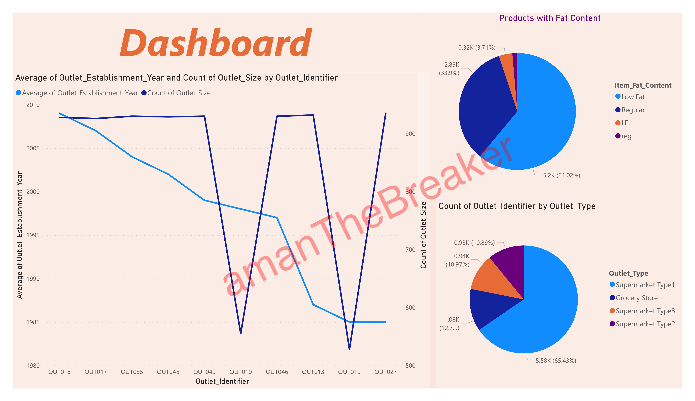
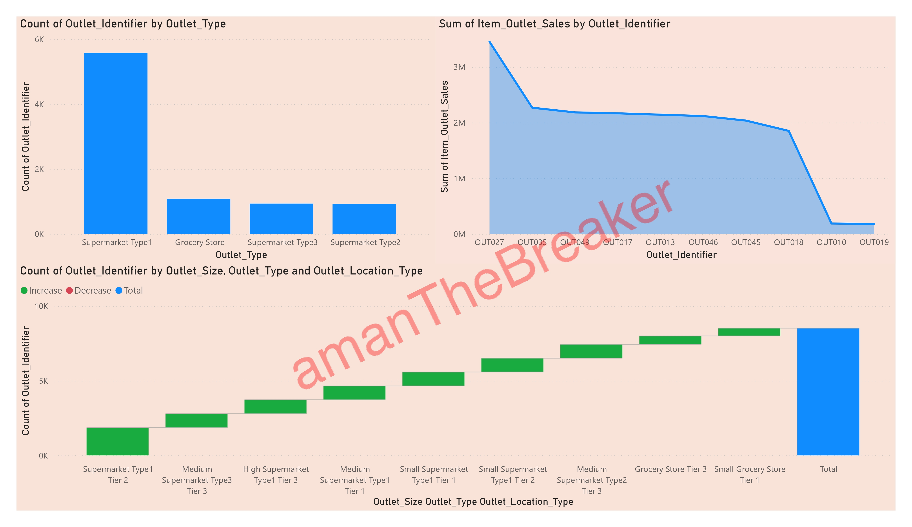
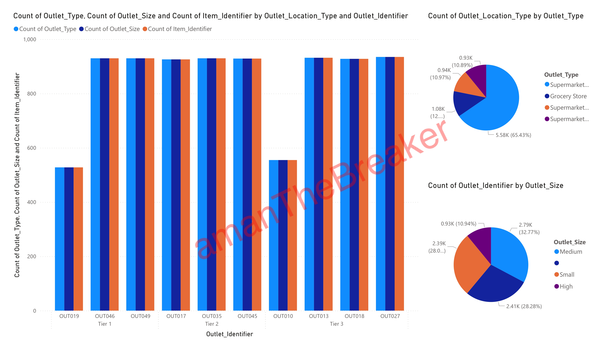
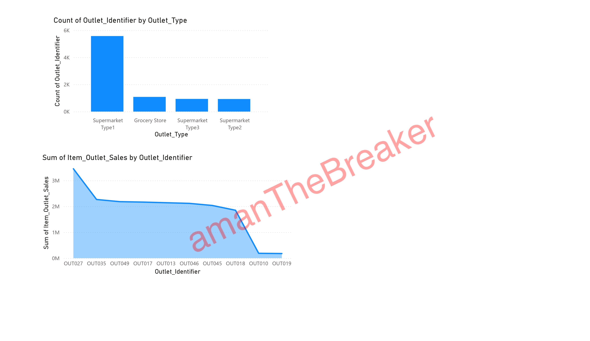

# Patanjali Outlet Sales Analysis

This project focuses on scraping data from various outlets to extract information on special products and their associated reviews. Additionally, it includes a predictive analysis of outlet sales using a dataset provided by Kaggle, specifically for Patanjali products.

## Project Overview

The goal of this project is twofold:
1. **Scraping and Analysis**: Collect data from various outlets on special products, including reviews and product features.
2. **Sales Prediction**: Use the provided dataset to predict outlet sales using machine learning models.

## Key Features

1. **Data Scraping**:
   - Scraped data from multiple online retail outlets to extract details on products and their reviews.
   - Special focus on unique and featured products.

2. **Sales Prediction**:
   - Predicted outlet sales using features such as item type, fat content, outlet size, and outlet type.
   - Implemented multiple machine learning algorithms to build and optimize predictive models.

3. **Visualization**:
   - Created visual dashboards using Power BI to represent:
     - Outlet sales trends by outlet type and size.
     - Product distribution by fat content and type.
     - Overall sales distribution across different outlets.

## Tools and Technologies

- **Data Scraping**: BeautifulSoup, Requests
- **Machine Learning**: Scikit-learn, Pandas, NumPy
- **Visualization**: Power BI
- **Dataset**: Patanjali Kaggle dataset

### Data Source

The primary dataset used for sales prediction is obtained from the [Global Data]([https://www.kaggle.com](https://www.globaldata.com/company-profile/ruchi-soya-industries-ltd/premium-data/),  [Patanjali Kaggle Dataset](https://www.kaggle.com),  [Patanjali's Stock Kaggle Dataset]([https://www.kaggle.com](https://www.kaggle.com/datasets/nitirajkulkarni/patanjali-ns-stock-performance)). This dataset includes information about various products sold through outlets, along with details on outlet characteristics and sales history.

**Visualization**:
   - The Power BI `.pbix` file can be opened in Power BI Desktop for an interactive dashboard view.

## Results

The results of the analysis, including sales predictions and trends across different outlets, are documented in the final report. 

## Contributing

Contributions are welcome! Please fork this repository and submit a pull request for review.

